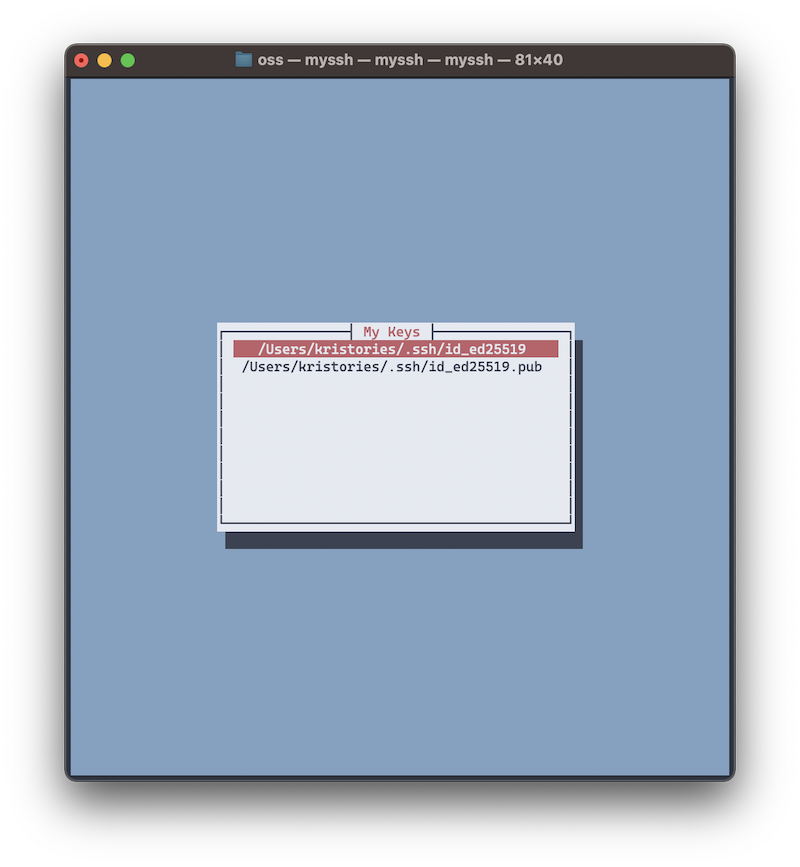

# MySSH

MySSH is a simple tool to check for existing SSH keys in your `.ssh` directory and view their contents.



## Installation

You can install MySSH using Homebrew:

### Step 1: Add the formula to Homebrew

If this is your first time installing from the `devtical` tap, you'll need to add it:

```bash
brew tap devtical/formulae
```

### Step 2: Install MySSH

After adding the tap, install MySSH by running:

```bash
brew install devtical/formulae/myssh
```

## Usage

Once installed, you can run MySSH directly from your terminal:

```bash
myssh
```

This will display a list of SSH keys available in your `.ssh` directory. Select any key to view its contents.

## License

This project is licensed under the Apache License 2.0. See the [LICENSE](LICENSE) file for more details.

