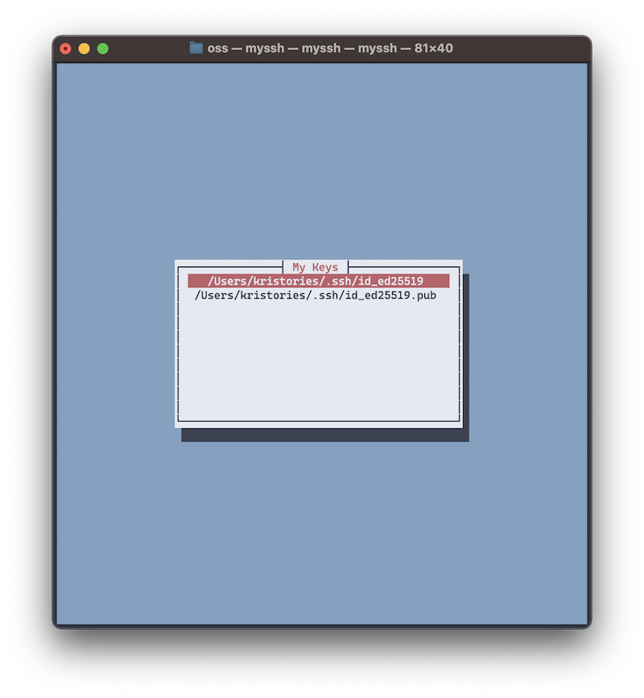

# MySSH

MySSH is a terminal tool to inspect and manage SSH keys in your `.ssh` directory. It provides an interactive TUI for browsing keys and a CLI for scripting and automation.



## Installation

You can install MySSH using Homebrew:

### Step 1: Add the formula to Homebrew

If this is your first time installing from the `devtical` tap, you'll need to add it:

```bash
brew tap devtical/formulae
```

### Step 2: Install MySSH

After adding the tap, install MySSH by running:

```bash
brew install devtical/formulae/myssh
```

You can also build from source with Rust 2021 edition:

```bash
cargo install --path .
```

## Usage

### Interactive mode

Run `myssh` without arguments to open the TUI:

```bash
myssh
```

Select a key to view its details, including the public key, fingerprint, permissions, and private key contents. Press `q` to quit.

### CLI commands

```bash
# List all private keys
myssh list
myssh list --json

# Show full key details
myssh show id_ed25519

# Show fingerprint only
myssh fingerprint id_ed25519
myssh fingerprint id_ed25519 --json

# Generate a new key pair
myssh generate
myssh generate --name my_key --algorithm ed25519 --comment "user@host"
myssh generate --name my_key --passphrase "secret"

# ssh-agent integration
myssh add id_ed25519
myssh remove id_ed25519
myssh agent-list

# Import and export key pairs
myssh export id_ed25519 ~/backup/
myssh import ~/backup/
```

### Custom SSH directory

By default, MySSH reads from `~/.ssh`. To use a different directory:

```bash
myssh --ssh-dir /path/to/ssh list
```

Or set the environment variable:

```bash
export MYSSH_DIR=/path/to/ssh
myssh list
```

## License

This project is licensed under the Apache License 2.0. See the [LICENSE](LICENSE) file for more details.
